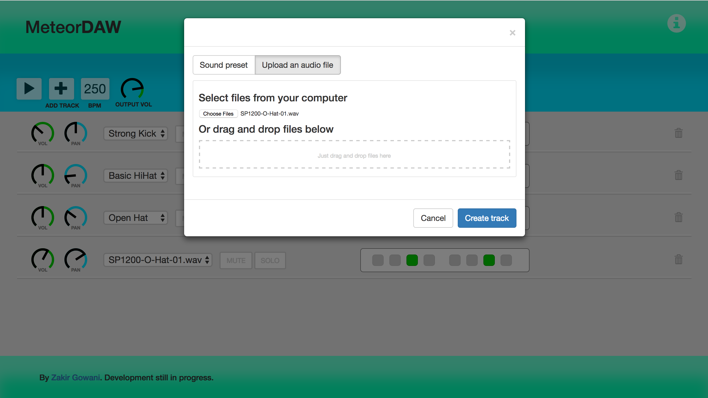

# MeteorDAW

#### A mobile-friendly music sequencing web app written in MeteorJS. 

##### Screenshots:
 


##### Features:
- sequencer functionality: program rhythms at a range of tempos with sound presets
- track controls: mute, solo, volume/pan knobs, sequencer steps, sound selection
- master controls: play, pause, add new tracks, adjust tempo, master volume
- tempo can be changed during playback
- responsive layout, works well on iPhone 5 (320px)

##### Build instructions:
Install <a href="https://www.meteor.com/" target="_blank">Meteor</a> and then run
```
git clone https://github.com/ZakirG/meteor-daw.git
cd meteor-daw/
meteor
```
You may be prompted to install additional packages. 
Once the app is running, navigate to http://localhost:3000/ in your browser.

##### Upcoming features in release 1.0:
- allow for user-uploaded sounds for sequencing
- finer control over time-divisions
- sequence export to wav

##### Feature goals for v2.0:
- a midi-compatible piano roll
- allow for user-uploaded audio tracks with preview waveforms
- more precise audio scheduling to avoid timing issues during paints
- VST-like track effects with the Web Audio API and <a href="http://sox.sourceforge.net/Docs/FAQ" target="_blank">SoX</a>
- an undo button, a redo button, an undo history with human-readable action descriptions
- keyboard shortcuts

Project started 11/29/2016.

Thank you to <a href="https://github.com/eskimoblood/jim-knopf" target="_blank">eskimoblood</a> for their knob control library, used in this application.