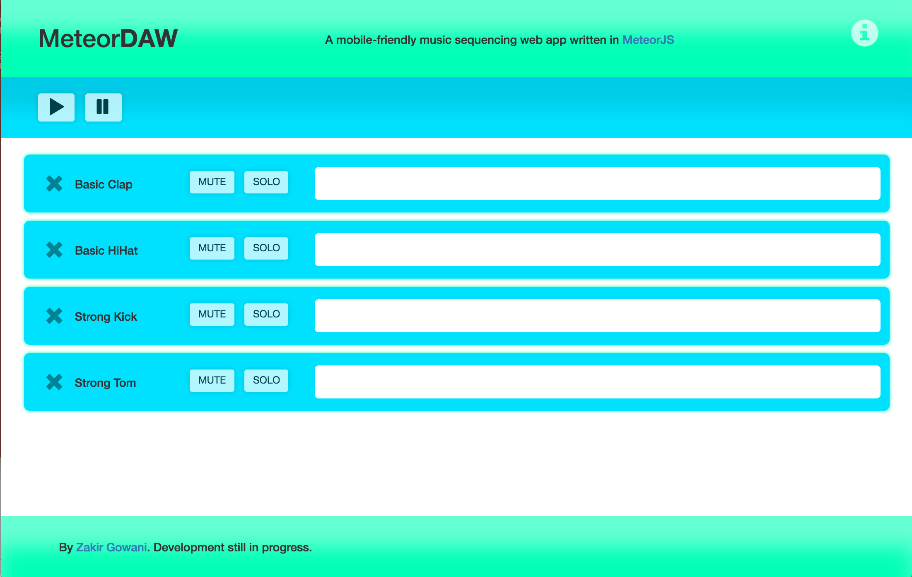

# MeteorDAW

#### A mobile-friendly music sequencing web app written in MeteorJS. 

##### Screenshots:
 

##### Features:
- sequencer functionality: program rhythms w/ presets and user-uploaded sounds
- responsive layout, works well on iPhone 6 (375px width)
- track controls: mute, solo, volume/pan knobs, sequencer steps, sound selection
- master controls: play, pause, add new tracks, adjust tempo, master volume
- sequences can be bounced and exported to .wav files

##### Build instructions:
Install <a href="https://www.meteor.com/" target="_blank">Meteor</a> and then run
```
git clone https://github.com/ZakirG/meteor-daw.git
cd meteor-daw/
meteor
```
You may be prompted to install additional packages. 
Once the app is running, navigate to http://localhost:3000/ in your browser.

##### Upcoming features for release 1.0:
- a dynamic grid to allow sequencing with eighth, 16th, and 32nd notes
- sequence presets

##### Feature goals for v2.0:
- a midi-compatible piano roll
- allow for user-uploaded audio tracks with preview waveforms
- more precise audio scheduling to avoid timing issues during paints
- VST-like track effects with the Web Audio API and <a href="http://sox.sourceforge.net/Docs/FAQ" target="_blank">SoX</a>
- an undo button, a redo button, an undo history with human-readable action descriptions
- keyboard shortcuts

Project started 11/29/2016.

Thank you to <a href="https://github.com/eskimoblood/jim-knopf" target="_blank">eskimoblood</a> for their knob control library, used in this application.

Thank you to <a href="https://github.com/cwilso/" target="_blank">cwilso</a> for inspiration on using Web Workers for <a href="https://github.com/cwilso/MIDIDrums/">note scheduling functionality in a drum sequencer.</a> 

Thank you to <a href="https://github.com/mattdiamond/" target="_blank">mattdiamond</a> for their <a href="https://github.com/mattdiamond/Recorderjs">RecorderJS library.</a>, without which bounce functionality would not have been possible.